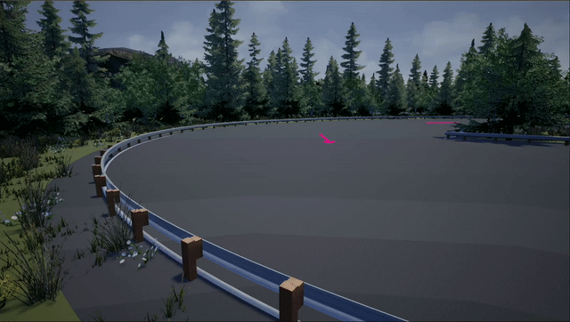
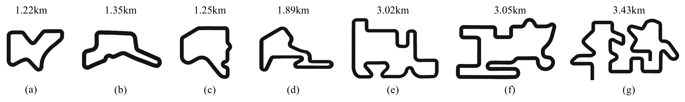

# High-speed Autonomous Drifting with Deep Reinforcement Learning

 

## Reference trajectorires for seven maps

 

Reference trajectories for the maps are located in `code/ref_trajectory`

**traj_0**: for map(a), for first-stage training.

**traj_1...traj_5**: for map(b-f), for second-stage training.

**traj_6**: for map(g), for evaluation

## Trained weights for different models
weights are located in `weights/`, where four models are included. Note that `sac-stg1` and `sac-stg2` are different stages of our SAC controller during training. `sac-stg2` is the final version and `sac-stg1` are only trained on map(a).

## Test code
run `sh code/test.sh` to test different models on map(g) with various setups. The driving data (timestamp, speed, location, heading, slip angle, control commands, etc.) will be recorded in `code/test/` after the testing process.

[Project homepage](https://sites.google.com/view/autonomous-drifting-with-drl)