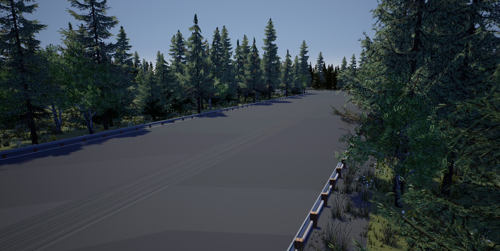

# High-speed Autonomous Drifting with Deep Reinforcement Learning
*IEEE Robotics and Automation Letters & ICRA-2020*

🖥️ [Homepage](https://sites.google.com/view/autonomous-drifting-with-drl) 📜 [Paper](https://arxiv.org/abs/2001.01377) 


<div align=center> 


</div>

## Requirements
1. Tested on Ubuntu 16.04 and Ubuntu 20.04.
2. Nvidia GPU equipped, and driver Installed. Tested on GTX 1080Ti.
3. Install [Anaconda](https://www.anaconda.com/), which is a package manager, environment manager, and Python distribution.
4. Install the environment:
```console
conda env create -f environment_drift.yaml
```
This command will create a conda environment named `drift`


## Reference trajectorires for seven maps
<div align=center> 
</div>

Reference trajectories for the maps are located in `code/ref_trajectory`

**traj_0**: for map(a), for first-stage training.

**traj_1...traj_5**: for map(b-f), for second-stage training.

**traj_6**: for map(g), for evaluation

## Start the Simulator
We build the simulator based on [Carla 0.9.5](https://carla.readthedocs.io/en/0.9.5/getting_started/). You can download our build version [from this link](https://drive.google.com/drive/folders/1JBwUr5OzbemR3XDu9tG0BEFJEHQ-vp_Z?usp=sharing).

Then add these two lines to your `~/.bashrc` (assume you download the simulator to `Downloads` folder):
```
export PYTHONPATH=$PYTHONPATH:~/Downloads/CARLA_DRIFT_0.9.5/PythonAPI/carla/dist/carla-0.9.5-py3.5-linux-x86_64.egg
export PYTHONPATH=$PYTHONPATH:~/Downloads/CARLA_DRIFT_0.9.5/PythonAPI/carla/
```
Then open a new terminal and start the simulator:
```console
cd ~/Downloads/CARLA_DRIFT_0.9.5
./CarlaUE4.sh /Game/Carla/ExportedMaps/test_refined
```
<div align=center> 

</div>

You can use `W A S D` and mouse to navigate in the simulator. Press `Alt+Tab` to restore your cursor.


## Test the Model
Model weights are located in `weights/`, where four kinds of models are included: **SAC, SAC-WOS, DDPG, DQN**

Note that `sac-stg1` and `sac-stg2` are different stages of our SAC controller during training. `sac-stg2` is the final version and `sac-stg1` are only trained on map(a).

To test the models, make sure you have started the simulator, then open a new terminal and do the followings:

```console
cd code
conda activate drift
sh test.sh
```

Then different models will be tested on map(g). The driving data (timestamp, speed, location, heading, slip angle, control commands, etc.) will be recorded in `code/test/` after the testing process.

***If you want to test a single model, for example, DQN:***
```console
cd code
conda activate drift
python test_dqn.py
```

## Citation

Please consider to cite our paper if this work helps:
```
@article{Cai2020HighSpeedAD,
  title={High-Speed Autonomous Drifting With Deep Reinforcement Learning},
  author={Peide Cai and X. Mei and L. Tai and Yuxiang Sun and M. Liu},
  journal={IEEE Robotics and Automation Letters},
  year={2020},
  volume={5},
  pages={1247-1254}
}
```